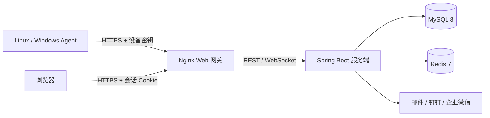

# 系统架构

## 范围

观澜监控由 Go Agent、Spring Boot 服务端、Vue 3 Web 控制台、外部 MySQL 与 Redis 组成。本仓库不包含鸿蒙 APP；移动浏览器通过响应式 Web 控制台访问相同能力。

## 组件职责

### Agent

- 使用 `gopsutil` 采集主机、CPU、内存、交换分区、磁盘、网络、进程、温度和指定服务状态。
- 可按挂载点限制磁盘采集，并可跳过进程扫描与 TCP 连接枚举以降低主机开销。
- 支持 1 秒、3 秒、10 秒或 1–60 秒自定义采集周期。
- 每次采集先原子写入本地磁盘队列，再按时间顺序上报；网络恢复后自动补传。
- 使用设备 ID 与一次性生成的设备密钥认证。非本机地址默认强制 HTTPS。

### 服务端

- 基于 Spring Boot 3、Spring Security、JPA 与 Flyway。
- 设备密钥只存 BCrypt 哈希；明文仅在创建和轮换响应中返回一次。
- 会话使用 `HttpOnly`、`SameSite=Lax` Cookie，写操作要求 CSRF Token，登录有速率限制并在成功后轮换会话 ID。
- 指标写入 MySQL，在线状态可通过 Redis 缓存；MySQL 是最终数据源。
- 每 10 秒执行离线检测，每天清理过期指标。离线规则会持续评估，Agent 恢复后自动关闭对应告警。
- WebSocket 仅向已登录会话广播 `metric.updated`、`alert.opened` 和 `alert.resolved`；客户端断线时以 REST 轮询为准。

### Web 控制台

- Vue 3、TypeScript、Pinia、Vue Router、Element Plus、Lucide 与 ECharts。
- 路由包含运行总览、设备列表与详情、趋势、磁盘、进程、服务、告警事件、告警规则、系统设置、账号权限和审计日志。
- 桌面端使用 240px 侧栏，窄屏切换为抽屉导航；支持浅色、深色、键盘焦点和 `prefers-reduced-motion`。
- 浏览器路由守卫仅用于交互引导，所有权限仍由服务端强制执行。

## 权限模型

| 能力 | ADMIN | OPERATOR | VIEWER |
| --- | --- | --- | --- |
| 查看监控、设备、告警 | 是 | 是 | 是 |
| 创建和编辑设备 | 是 | 是 | 否 |
| 轮换密钥、删除设备 | 是 | 否 | 否 |
| 确认告警、管理规则 | 是 | 是 | 否 |
| 系统设置、账号、审计 | 是 | 否 | 否 |

## 数据模型

- `users`：账号、BCrypt 密码哈希、角色和启用状态。
- `devices`：设备元数据、密钥哈希、在线状态、最近上报时间和硬件快照。
- `metric_snapshots`：按时间记录聚合指标及磁盘、进程、服务 JSON 快照。
- `alert_rules`：全局或设备级阈值规则。
- `alert_events`：告警开启、确认、恢复时间和处理人。
- `system_settings`：运行参数与使用 AES-256-GCM 加密的通知凭据；API 只返回配置状态，不回传明文。
- `audit_logs`：关键管理操作的操作者、目标和摘要。

## 可靠性与安全边界

- Agent 的磁盘队列有容量上限，满载时按 FIFO 删除最旧报告，避免占满主机磁盘。
- Agent 上报接口不使用浏览器会话和 CSRF，而使用独立设备凭据；其他写接口必须通过会话与 CSRF 双重校验。
- SMTP 密码和机器人 Webhook 可从环境变量回退，或以 AES-256-GCM 密文保存；设置 API 永不返回明文。
- `SETTINGS_ENCRYPTION_KEY` 必须独立保管并随数据库备份保存，丢失后数据库中的通知凭据无法恢复。
- 生产环境必须在 Web 网关前终止 TLS，并设置 `SESSION_COOKIE_SECURE=true` 与精确的 `ALLOWED_ORIGINS`。
- Redis 仅位于 Docker 内部网络，不在 Compose 中发布宿主机端口；外部 MySQL 的监听与防火墙由部署者管理。
