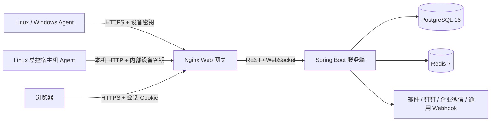

# 系统架构

## 范围

星辰监控由 Go Agent、Spring Boot 服务端、Vue 3 Web 控制台、内置 PostgreSQL 与 Redis 组成。本仓库不包含鸿蒙 APP；移动浏览器通过响应式 Web 控制台访问相同能力。

## 组件职责

### Agent

- 使用 `gopsutil` 采集主机、CPU、内存、交换分区、磁盘、网络、进程、温度和指定服务状态。
- 可按挂载点限制磁盘采集，并可跳过进程扫描与 TCP 连接枚举以降低主机开销。
- 支持 1 秒、3 秒、10 秒或 1–60 秒自定义采集周期。
- 每次采集先原子写入本地磁盘队列，再按时间顺序上报；网络恢复后自动补传。
- 使用设备 ID 与一次性生成的设备密钥认证。非本机地址默认强制 HTTPS；安装器仅在 HTTPS 检查失败且 HTTP 可用时显式启用明文连接。
- Linux 总终端安装器可自动启动受管 Agent；它通过只读宿主机挂载采集真实主机指标，并复用标准设备上报接口。
- 远程命令执行默认关闭；开启后 Agent 通过设备密钥轮询一次性任务，直接启动命令并按超时/输出上限回传结果。

### 服务端

- 基于 Spring Boot 3、Spring Security、JPA 与 Flyway。
- 设备密钥只存 BCrypt 哈希；明文仅在创建和轮换响应中返回一次。
- 会话使用 `HttpOnly`、`SameSite=Lax` Cookie，写操作要求 CSRF Token，登录有速率限制并在成功后轮换会话 ID；启用 TOTP 的账号必须完成 5 分钟内的验证码挑战。TOTP 密钥使用设置加密密钥以 AES-256-GCM 密文保存，不进入日志或用户列表。
- 指标写入 PostgreSQL，在线状态可通过 Redis 缓存；PostgreSQL 是最终数据源。
- 每 10 秒执行离线检测，每天清理过期指标。离线规则会持续评估，Agent 恢复后自动关闭对应告警。
- WebSocket 仅向有对应设备查看权限的已登录会话发送 `metric.updated`、`alert.opened` 和 `alert.resolved` 最小刷新事件，消息不携带指标值或告警正文；客户端断线时以 REST 轮询为准。

### Web 控制台

- Vue 3、TypeScript、Pinia、Vue Router、Element Plus、Lucide 与 ECharts。
- 路由包含运行总览、设备列表与详情、趋势、磁盘、进程、服务与外部心跳、告警事件、告警规则、系统设置、账号权限和审计日志。
- 桌面端使用 240px 侧栏，窄屏切换为抽屉导航；支持浅色、深色、键盘焦点和 `prefers-reduced-motion`。设备详情可从历史快照筛选容器与进程，展示资源和容器网络趋势。
- 浏览器路由守卫仅用于交互引导，所有权限仍由服务端强制执行。

## 权限模型

ADMIN 始终拥有全部设备权限。OPERATOR 和 VIEWER 只能访问管理员明确分配的设备；设备权限分为查看数据、管理资料、处理告警和执行任务，后三项会自动包含查看权限。角色仍是操作上限，例如 VIEWER 即使保留历史操作权限记录也不能执行写操作。OPERATOR 新建设备时自动获得该设备四项权限，全局告警规则和全局维护窗口只允许 ADMIN 管理。

| 能力 | ADMIN | OPERATOR | VIEWER |
| --- | --- | --- | --- |
| 查看已授权设备、指标、告警、报告 | 全部设备 | 需“查看数据” | 需“查看数据” |
| 创建设备 | 是 | 是，新设备自动授权 | 否 |
| 编辑设备资料与工作记录 | 是 | 需“管理资料” | 否 |
| 确认告警、管理设备级规则与维护 | 是 | 需“处理告警” | 否 |
| 创建和取消 Agent 任务 | 是 | 需“执行任务” | 否 |
| 全局策略、系统设置、账号、审计 | 是 | 否 | 否 |

## 数据模型

- `users`：账号、BCrypt 密码哈希、角色和启用状态。
- `user_device_permissions`：非管理员账号到设备的查看、管理、告警和任务权限。
- `devices`：设备元数据、密钥哈希、在线状态、最近上报时间、硬件快照和系统管理标记。
- `metric_snapshots`：按时间记录聚合指标及磁盘、进程、服务 JSON 快照。
- `alert_rules`：全局或设备级阈值规则。
- `alert_events`：告警开启、确认、恢复时间和处理人。
- `system_settings`：运行参数与使用 AES-256-GCM 加密的通知凭据；API 只返回配置状态，不回传明文。
- `audit_logs`：关键管理操作的操作者、目标和摘要。
- `agent_tasks`：目标设备、命令参数、队列状态、超时、输出和执行审计信息。
- `service_checks` / `service_check_results`：HTTP、Ping、TCP、Redis、PostgreSQL、MySQL 和外部心跳监控配置、探测结果与七日可用率；数据库探测使用无凭据协议握手，心跳令牌只保存摘要。

## 可靠性与安全边界

- Agent 的磁盘队列有容量上限，满载时按 FIFO 删除最旧报告，避免占满主机磁盘。
- Agent 上报接口不使用浏览器会话和 CSRF，而使用独立设备凭据；其他写接口必须通过会话与 CSRF 双重校验。
- SMTP 密码和机器人 Webhook 可从环境变量回退，或以 AES-256-GCM 密文保存；设置 API 永不返回明文。通用 Webhook 通过受限格式适配 Slack、Discord、飞书/Lark 和纯文本端点。
- `SETTINGS_ENCRYPTION_KEY` 必须独立保管并随数据库备份保存，丢失后数据库中的通知凭据无法恢复。
- 生产环境必须在 Web 网关前终止 TLS，并设置 `SESSION_COOKIE_SECURE=true` 与精确的 `ALLOWED_ORIGINS`。
- PostgreSQL 与 Redis 仅位于 Docker 内部网络，不在 Compose 中发布宿主机端口；数据分别持久化到项目卷。
- 总控 Agent 的密钥仅保存在控制端私有 `.env`；它不能通过 Web 控制台轮换或删除，避免控制端失去自身指标。
